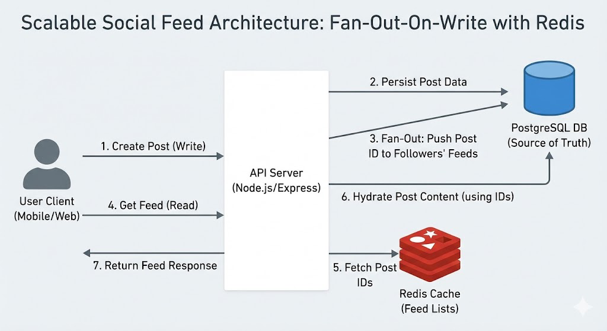

# 🚀 Scalable Social Media Feed API


A high-performance backend API designed to handle **read-heavy** social media workloads. This system implements the **Fan-Out-On-Write** architecture pattern to deliver near-instant feed retrieval using **Redis Caching**, alongside **Cursor-Based Pagination** for infinite scrolling and **ACID transactions** for data integrity.

---

## 📑 Table of Contents
- [Architecture & Design](#-architecture--design)
- [Features](#-features)
- [Tech Stack](#-tech-stack)
- [Project Structure](#-project-structure)
- [Getting Started](#-getting-started)
- [Environment Variables](#-environment-variables)
- [API Documentation](#-api-documentation)
- [Future Improvements](#-future-improvements)

---

## 🏗 Architecture & Design

This system solves the "Celebrity Problem" and slow feed loading times by shifting the computational cost from **Read time** to **Write time**.



### Key Design Decisions:
1.  **Fan-Out-On-Write (Push Model):**
    * When a user creates a post, the system asynchronously "pushes" the Post ID to the Redis cache of all their followers.
    * **Trade-off:** Slower write (post creation) for lightning-fast reads (feed loading).
2.  **Redis Sorted Sets (ZSET):**
    * Used to store user feeds.
    * **Score:** Unix Timestamp (for sorting).
    * **Value:** Post ID.
    * Allows efficient range queries (`ZREVRANGEBYSCORE`) for pagination.
3.  **Cursor-Based Pagination:**
    * Unlike `OFFSET` pagination, this remains stable even if new posts are added while a user is scrolling.
    * We use the timestamp of the last seen post as the cursor.
4.  **Denormalization & Transactions:**
    * Counters like `follower_count` and `like_count` are stored on the tables to avoid expensive `COUNT(*)` queries.
    * Updates are wrapped in **SQL Transactions** to ensure data consistency.

---

## ✨ Features

* **Authentication:** User registration and management.
* **Social Graph:** Follow/Unfollow users with transactional integrity.
* **Post Broadcasting:** Posts are instantly distributed to followers' caches.
* **Smart Feed:** Personalized feed retrieval with <50ms latency.
* **Infinite Scroll:** Optimized pagination using cursors.
* **Interactions:** Like/Unlike posts with real-time counter updates.
* **Compatibility:** Custom Redis implementation to support both Windows (Redis 5) and Linux environments.

---

## 🛠 Tech Stack

| Component | Technology | Description |
| :--- | :--- | :--- |
| **Runtime** | Node.js | Backend logic execution |
| **Framework** | Express.js | REST API routing and middleware |
| **Database** | PostgreSQL | Primary source of truth (Relational Data) |
| **Cache** | Redis | In-memory store for feeds (Speed Layer) |
| **Containerization** | Docker | Containerized deployment via Docker Compose |

---

## 📂 Project Structure

```bash
social-feed-api/
├── src/
│   ├── config/
│   │   ├── db.js           # PostgreSQL Connection Pool
│   │   └── redisClient.js  # Redis Client Configuration
│   ├── controllers/
│   │   ├── userController.js # Auth & Follow Logic
│   │   └── postController.js # Post, Like, & Feed Logic (Fan-out)
│   ├── routes/
│   │   ├── authRoutes.js
│   │   ├── userRoutes.js
│   │   └── postRoutes.js
│   └── index.js            # Entry Point
├── .env.example            # Environment variables template
├── docker-compose.yml      # Docker services configuration
├── Dockerfile              # API container definition
├── init-db.js              # Database Initialization Script
├── schema.sql              # SQL Schema definitions
├── api-spec.yaml           # OpenAPI Specification
└── README.md               # Documentation
````

-----

## 🚀 Getting Started

You can run this project using **Docker** (Recommended for evaluators) or **Manually** (For local development).

### Prerequisites

  * [Node.js](https://nodejs.org/) (v14+)
  * [PostgreSQL](https://www.postgresql.org/) (Port 5432)
  * [Redis](https://redis.io/) (Port 6379)
  * [Docker Desktop](https://www.docker.com/) (Optional, for Docker mode)

### Option 1: Running with Docker (Recommended)

This will spin up the API, Database, and Cache containers and automatically initialize the schema.

1.  **Clone the repository:**
    ```bash
    git clone [https://github.com/yourusername/social-feed-api.git](https://github.com/yourusername/social-feed-api.git)
    cd social-feed-api
    ```
2.  **Start the services:**
    ```bash
    docker-compose up --build
    ```
3.  **Access the API:**
    The server will be available at `http://localhost:3000`.

### Option 2: Running Manually

1.  **Install dependencies:**
    ```bash
    npm install
    ```
2.  **Configure Environment:**
    Create a `.env` file based on `.env.example` or update `src/config/db.js` with your local credentials.
3.  **Initialize Database:**
    ```bash
    node init-db.js
    ```
    *Output should be: `✅ Database tables created successfully!`*
4.  **Run the Server:**
    ```bash
    node src/index.js
    ```

-----

## 🔐 Environment Variables

Create a `.env` file in the root directory (automatically handled in Docker mode):

```ini
PORT=3000
DB_HOST=localhost
DB_USER=postgres
DB_PASSWORD=your_password
DB_NAME=social_feed
REDIS_URL=redis://localhost:6379
```

-----

## 📡 API Documentation

For full details, see the `api-spec.yaml` file included in this repository.

### Auth & Users

| Method | Endpoint | Description | Body Example |
| :--- | :--- | :--- | :--- |
| `POST` | `/auth/register` | Register new user | `{"username": "alice", "email": "a@a.com", "password": "123"}` |
| `POST` | `/users/follow` | Follow a user | `{"follower_id": 1, "following_id": 2}` |

### Posts & Feed

| Method | Endpoint | Description | Body / Query Params |
| :--- | :--- | :--- | :--- |
| `POST` | `/posts` | Create Post (Triggers Fan-out) | `{"user_id": 2, "content": "Hello World"}` |
| `POST` | `/posts/:id/like` | Like a Post | `{"user_id": 1}` |
| `GET` | `/posts/feed` | Get User Feed | `?user_id=1&cursor=17100000` |

-----

## 🔮 Future Improvements

  * **Hybrid Feed:** Implement "Pull" model for celebrity users (users with \>1M followers) to prevent Redis write bottlenecks.
  * **Job Queue:** Move the fan-out process to a background queue (e.g., BullMQ) for better reliability.
  * **WebSockets:** Real-time notification when a new post arrives.

-----

